# **Part 4: Building a RAG CLI Chatbot from Scratch (with Ollama, Gemini, and Qdrant)**

In Parts 1–3, I set up Ollama, introduced retrieval-augmented generation (RAG) and useful tooling, and built a document ingestion pipeline. In this part, I’ll bring all the pieces together by building a command-line RAG chatbot from scratch.

This article is for developers who want to deeply understand how RAG systems work under the hood—without relying on heavy abstractions. If you enjoy tinkering, inspecting intermediate results, and experimenting with AI components, this is for you.

While frameworks like LangChain or tools like Open WebUI abstract away complexities, building my own CLI chatbot provides a transparent view of the core RAG mechanics. Unlike off-the-shelf solutions, this chatbot shows each part of the RAG process—retrieval, scoring, prompting, and response. This approach makes it an excellent base for learning, debugging, and comparing different tools, allowing me to:

* **Inspect the process:** See exactly which document chunks are retrieved for a query, their similarity scores, and how they are used to build the final prompt for the LLM.  
* **Embrace modularity:** The modular codebase makes it easy to trace different pieces and swap out components, such as the LLM provider or embedding model, for comparison and experimentation.

This project is not only a working chatbot but also a foundational tool for learning and experimenting with the full RAG stack.

## **How I Coded This CLI RAG Chatbot**

The journey to building this chatbot started when I worked with Gemini to define the high-level requirements and a phased implementation plan. This work was formalized into a [GitHub Issue](https://github.com/able-wong/rag-cli-chatbot/issues/1). With a clear plan, I then asked Claude Code to fetch the issue and implement the application, refining parts of the logic as needed. The result was a completed, working application. After some testing and minor tweaks, the chatbot was ready.

## Chatbot in Action**

Let's see the chatbot in action first. You can try this yourself by checking out the code:

```bash
git clone https://github.com/able-wong/rag-cli-chatbot.git
cd rag-cli-chatbot
git checkout 0.0.1
```

Follow the setup instructions in the README.md, then start chatting.

First, try it with a simple chat query:

[[placeholder of screenshot with "What is RAG chatbot" prompt and response]]

But the real power comes with RAG queries using the @knowledgebase trigger. My ingestion pipeline ingested my blog posts into the vector DB, and they have content with "Vibe Coding."

[[placeholder of screenshot with "search @knowledgebase on vibe coding" prompt and response]]

As you can see, the source documents retrieved from the RAG search are also listed, including their relevance score. Higher scores mean more relevant. The application is coded to show this verbose output to demonstrate how it works. You can then use /doc 1 to view details of the first source, including the full chunk text and metadata.

## **Key Design Decisions**

The design of this RAG chatbot was guided by three core decisions:

* **Why an Explicit RAG Trigger?** My main goal was to have a working chatbot quickly. An explicit trigger (@knowledgebase) allowed for a simple string match, which was faster to implement than an implicit trigger that would require more complex intent detection. This also gives the user full control over when to perform a RAG search.  
* **Why a Multiple-Provider Architecture?** Similar to the ingestion pipeline, this architecture allows me to choose providers based on my needs. While I tested with Ollama, running a local Ollama server in production often requires a costly GPU. Calling APIs like Gemini is a more economical option. This design allows for experimentation and provides flexibility.  
* **Why a Confidence-Based Response?** This is a direct feature of the Qdrant API. By setting a min_score threshold, I can filter out irrelevant results before sending them to the LLM. This is an important step to ensure the answers are grounded in the data and prevents the model from using unhelpful context.

## **System Architecture**

The chatbot's architecture builds on the vector db (Qdrant) populated by the ingestion pipeline from Part 3. Here is how the components interact:

```mermaid
graph TB
    User[👤 User] --> CLI[🖥️ CLI Interface]
    CLI --> CM[⚙️ Config Manager]
    CLI --> LLM[🧠 LLM Client]
    CLI --> EMB[📊 Embedding Client]
    CLI --> QDB[🗄️ Qdrant DB]
    
    CM --> CONFIG[📋 config.yaml]
    LLM --> OLLAMA[🦙 Ollama]
    LLM --> GEMINI[🔵 Gemini]
    EMB --> ST[🔤 SentenceTransformers]
    EMB --> OLLAMA
    EMB --> GEMINI
    QDB --> LOCAL[💻 Local Qdrant]
    QDB --> CLOUD[☁️ Qdrant Cloud]
    
    subgraph "Knowledge Base"
        VECTOR[(📚 Vector DB<br/>Documents Collection)]
    end
    
    QDB --> VECTOR
```



* config_manager.py: Handles loading all operational settings from a YAML configuration file and environment variables.  
* llm_client.py: Manages communication with configured LLMs (e.g., Ollama, Gemini).  
* embedding_client.py: Converts user queries into vector embeddings for similarity searches. It supports different providers.  
* qdrant_db.py: The client for our vector database, used to perform semantic searches.  
* cli.py: The main application class that orchestrates the entire process, manages conversation history, and provides the user interface.

## **How It Works: The RAG Flow**

The chatbot operates in two modes: a standard chat mode and a RAG-enabled mode.

### **1. Normal Chat Mode**

When a user's query does not contain the @knowledgebase trigger, the chatbot sends the conversation history directly to the LLM. The LLM generates a response based on its general knowledge.


### **2. RAG Mode**

When the @knowledgebase trigger is detected, the process changes:

1. The user's query is sent to the embedding_client to create a vector embedding.  
2. The vector embedding is used to perform a semantic search in the Qdrant database.  
3. If relevant documents are found above a certain threshold, their content is retrieved.  
4. The retrieved document content is added to the system prompt as context.  
5. The combined prompt is sent to the LLM, which generates a response based on this specific context.


## **The System Prompt**

To ensure the LLM behaves as expected in RAG mode, I provided it with a specific system prompt:

You are a helpful AI assistant with access to a knowledge base.  
When provided with context from the knowledge base, use it to answer questions accurately.  
If the context doesn't contain relevant information, clearly state that you cannot answer based on the available knowledge base.  
Never make up information that isn't in the provided context.

This prompt is crucial. It gives the LLM a way out when it lacks sufficient information, which is key to preventing the model from hallucinating. Instead of inventing an answer, it is explicitly instructed to decline. This helps ensure answers are grounded in relevant data, reducing the chance of hallucinations.

## Experimentation Ideas: Improving Accuracy and Control

This project is built for experimentation. I can easily swap out components to see their impact on performance and accuracy. Here are a few examples:

* **Embedding Models:** I used sentence-transformers because it runs locally and doesn't incur API costs. However, its 384-value vectors may not have the best accuracy. I can experiment by swapping this with models available from Gemini or Ollama. These models, trained on more data, might capture the meaning in a vector better, leading to improved document retrieval.  
* **LLM Models:** Different LLMs have different knowledge bases and instruction-following capabilities. For example, my classic test, asking Llama 3.2 about "Vibe Coding," often results in a "I don't know" answer, which shows the limits of its internal knowledge. I can experiment with different models to see how well they follow instructions or handle specific topics.  
* **Similarity Score Threshold:** The chatbot uses a configurable min_score to decide if retrieved information is relevant enough to be included in the prompt. A high score means the documents must be very similar to the query, resulting in fewer but more confident answers. A low score includes more documents but can risk adding noise. I can test with adjusting this value to see how it affects the chatbot's "No Answer" fallback and hallucination prevention.

## **Conclusion**

Building this CLI chatbot reveals how RAG systems actually work. Each component has a specific job, and understanding them separately makes the whole system clearer. The modular design also makes testing easier and allows you to swap components as needed.

This foundation prepares you for more advanced techniques like query rewriting, hybrid search, and implicit RAG triggering that I'll explore in future articles. You now have a working system you can extend and customize.

In Part 5, I’ll go further by exploring Query rewriting for better recall. Stay tuned!

---

*Note: This article was created with the help of artificial intelligence.*
