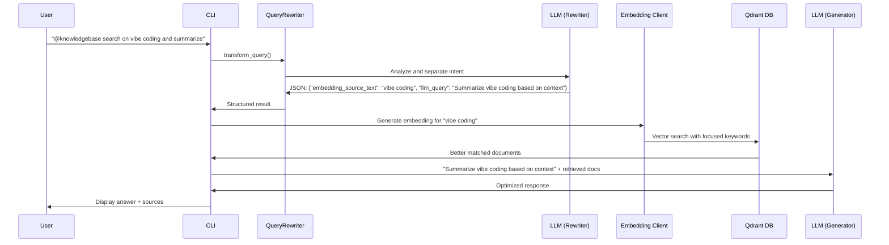

# **Part 5: Advanced RAG Techniques - LLM-Based Query Rewriting and HyDE**

In Part 4 of this series, I built a functional CLI RAG chatbot that could search documents and provide contextual answers. While the chatbot performed well, I knew from the initial planning stages that a key area for improvement would be using a single, multi-purpose prompt for both the vector database search and the LLM's response generation. My priority at the time was to get a working system in place quickly, and I saved this optimization for a later time.

This article details two incremental improvements—LLM-Based Query Rewriting and HyDE—that address this limitation. For those of you who enjoy tinkering with and optimizing AI systems, this post offers a practical next step in enhancing our RAG chatbot.

## **The Problem with Single-Purpose Prompts**

### **The Inefficiency**

Let's revisit a typical user input to the chatbot from Part 4: "@knowledgebase search on vibe coding, then summarize, list pros and cons"

**The prompt that was sent to the vector database and the LLM:**

* **Vector search query:** "search on vibe coding, then summarize, list pros and cons"  
* **LLM generation prompt (system prompt + context + cleaned up user input):**

```text
Based on the following context from the knowledge base, please answer the question:

Context:  
{context}

Question: search on vibe coding, then summarize, list pros and cons

Please provide a helpful answer based on the context above.  
If the context doesn't contain enough information to answer the question, please state that clearly.
```

### **Why This Matters**

This approach created a fundamental inefficiency and compromised accuracy. I realized a **vector database's** strength is its ability to find documents based on semantic similarity to a core concept, not to process instructions. When my search query included action-oriented terms like "search," "summarize," or "list pros and cons," it introduced noise that diluted the focus on the actual subject—"vibe coding." As a result, the database retrieved documents that were less precisely aligned with the user's information need because it was trying to match the entire complex instruction.

Similarly, a **Large Language Model (LLM)** performs best with clear, well-defined instructions. When the LLM received the original user query, it was being asked to "search" a knowledge base that was already provided to it as context. The LLM's true role in a RAG system is to **synthesize and generate a response** from the given information. Forcing it to interpret the user's original query from the context was an unnecessary and error-prone step. This could lead to less precise summaries, potential misinterpretations, and a higher risk of the model generating a response that wasn't fully grounded in the provided documents.

In essence, this method conflated the distinct responsibilities of **retrieval** (the vector database's job) and **generation** (the LLM's job). An optimal RAG system separates these two concerns, providing each component with a query or prompt specifically tailored to its function. This separation is key to building a more efficient, accurate, and robust chatbot.

## **Solution: Query Rewriter**

### **Get the code**

The code for this section can be accessed by switching to the 0.0.2 tag in the project repository.

```bash
git checkout 0.0.2
```

### **The Transformation Process**

The solution was to introduce a QueryRewriter that makes an additional LLM call to separate user intent into two optimized prompts. This new, two-step process allows the system to send a clean, focused query to the vector database and a clear, instruction-based prompt to the final LLM.



### The Power of LLM-Based Text Analysis

I discovered that using LLMs for intent separation is remarkably effective. Traditional NLP techniques struggle with parsing complex user requests, but with the right prompt, an LLM can:

* Extract core topics from verbose instructions  
* Generate structured JSON output consistently  
* Handle conversational context and follow-ups  
* Separate what to search for from what to do with the results

***Note:*** In this part, I switched to using the gemini-1.5-flash model for the LLM call, as I found that Llama 3.2 did not consistently follow instructions for generating the structured JSON output.

### How the Rewriter Works

The QueryRewriter sends a specific system prompt to the LLM. The llm_query result is then added to the system prompt before being sent to the final LLM. This dramatically improves the results because the LLM’s generative task is now clean and direct.

**System Prompt for the Rewriter:**

You must respond with a JSON object containing exactly these fields:

* "search_rag": boolean - True if query contains "@knowledgebase"  
* "embedding_source_text": string - Core topic keywords only, ignoring instruction words  
* "llm_query": string - Clear instruction for the LLM with appropriate context reference

**Input:** "@knowledgebase search on vibe coding, then summarize, list pros and cons"

**LLM Output (Rewrite Strategy):**

```json
{  
  "search_rag": true,  
  "embedding_source_text": "vibe coding programming approach",  
  "llm_query": "Based on the provided context, explain what vibe coding is, including its pros and cons, and cite sources."  
}
```

This separation allows the vector search to focus on finding documents about "vibe coding" while giving the LLM clear instructions on what to do with those documents.

[[Screenshot: Higher relevance scores after implementing Query Rewriter]]

## Further Enhancement: HyDE Strategy

### Get the code

The code for this section can be accessed by switching to the 0.0.3 tag in the project repository.

```bash
git checkout 0.0.3
```

### What is HyDE?

HyDE, or Hypothetical Document Embeddings, takes query optimization a step further by leveraging a generative LLM to improve retrieval. Instead of simply extracting keywords from the user's question, HyDE generates a "hypothetical document"—a guess at what a good answer might look like. This hypothetical answer is then used for the vector search.

Traditional approach: Search for documents containing "vibe coding"

HyDE approach: Search for documents similar to "Vibe coding is a programming approach that emphasizes writing code based on intuition and flow state..."

### Why HyDE Improves Matching

A hypothetical document embedding captures the semantic meaning of what a comprehensive answer should contain, not just the keyword matches of the query itself. This approach can find conceptually related documents that might not contain the exact search terms but discuss the same concepts. The LLM generates a plausible, context-rich document that bridges the gap between the query and the knowledge base, leading to more relevant retrieval, especially for vague or out-of-domain queries.

### Implementation Advantage

The existing QueryRewriter architecture was already well-suited for HyDE. The same JSON structure and integration points worked perfectly—only the system prompt needed updating:

**System Prompt Change:**

```diff
- "embedding_source_text": string - Core topic keywords only, ignoring instruction words  
+ "embedding_source_text": string - A focused 2-4 sentence hypothetical document that answers the core topic
```

### HyDE in Action

The system now uses the LLM to generate a hypothetical answer, which is then used to perform the vector search. This results in even better document retrieval.

**User:** "@knowledgebase search on vibe coding, then summarize, list pros and cons"

**LLM Output (HyDE Strategy):**

```json
{  
  "search_rag": true,  
  "embedding_source_text": "Vibe coding is a programming approach that emphasizes writing code based on intuition, flow state, and personal rhythm rather than strict methodologies. This coding style prioritizes developer comfort, creativity, and maintaining a natural coding rhythm. Practitioners focus on writing code that feels right and maintains consistent energy levels during development sessions.",  
  "llm_query": "Based on the provided context, explain what vibe coding is, including its pros and cons, and cite sources."  
}
```

The system now searches for documents semantically similar to this hypothetical explanation, potentially finding more relevant content than a simple keyword-based approach.

**Note:** You can see that the llm_query is different from the previous result, even with the same user input. This is because I have further tweaked the prompt to better tailor the instructions for LLM generation. While my blog post provides the context on "vibe coding," a successful HyDE implementation requires the LLM to have some prior knowledge to generate a high-quality hypothetical answer. For this particular example, a powerful, up-to-date LLM like Gemini or other models trained with recent data is essential, as a model like Llama 3.2 might not have the knowledge of a newer term like "vibe coding" to generate a useful hypothetical document.

## Configuration and Strategy Selection

The implementation allows easy switching between approaches via a configuration file. This makes it straightforward to compare strategies with your specific knowledge base and see which works better for your use cases.

```yaml
rag:  
  retrieval_strategy: "rewrite"  # Fast, keyword-based (default)  
  # retrieval_strategy: "hyde"   # Semantic-based understanding
```

[[Screenshot: /info command showing current strategy configuration]]

### Strategy Characteristics

| Strategy | Best For | Search Method | Example |
| :---- | :---- | :---- | :---- |
| **Rewrite** | Factual queries, direct questions | Keywords | "vibe coding" |
| **HyDE** | Conceptual questions, exploratory queries | Hypothetical documents | "Vibe coding is a programming approach..." |

## Real-World Impact

### Incremental Improvements

Both changes provide measurable improvements in document retrieval relevance:

* **0.0.1 (Basic):** Single prompt for both operations  
* **0.0.2 (Rewriter):** Separated search keywords from generation instructions  
* **0.0.3 (HyDE):** Semantic matching with hypothetical documents

[[Screenshot: Side-by-side comparison showing relevance score improvements across versions]]

The improvements are incremental but meaningful—better document matching leads to more accurate and relevant responses from the chatbot.

## Experimentation and Future Enhancements

The configuration toggle makes it simple to experiment and easily compare which strategy works better for your specific documents and query patterns.

These query transformation techniques also prepare the system for more sophisticated approaches:

* Hybrid search combining vector and metadata filtering  
* Query expansion and multi-query generation  
* Automatic RAG triggering without explicit phrases

The modular design means new strategies can be added by implementing new system prompts and updating the configuration options.

## Wrapping Up

Query transformation addresses a fundamental inefficiency in basic RAG systems: using one prompt for two different purposes. By separating search optimization from generation instructions, we achieve:

* More focused vector database searches with relevant keywords or hypothetical documents  
* Clearer LLM instructions that produce better responses  
* A flexible foundation for experimenting with different retrieval strategies  
* Measurable improvements in document relevance and response quality

These incremental improvements demonstrate how a modular design can be used to enhance RAG systems step by step, building a more robust and capable foundation for future techniques.

In the next article, I'll explore Hybrid Search with metadata filtering—combining semantic similarity with structured data filters for even more precise document retrieval. Stay tuned!

---

*Note: This article was created with the help of artificial intelligence.*
